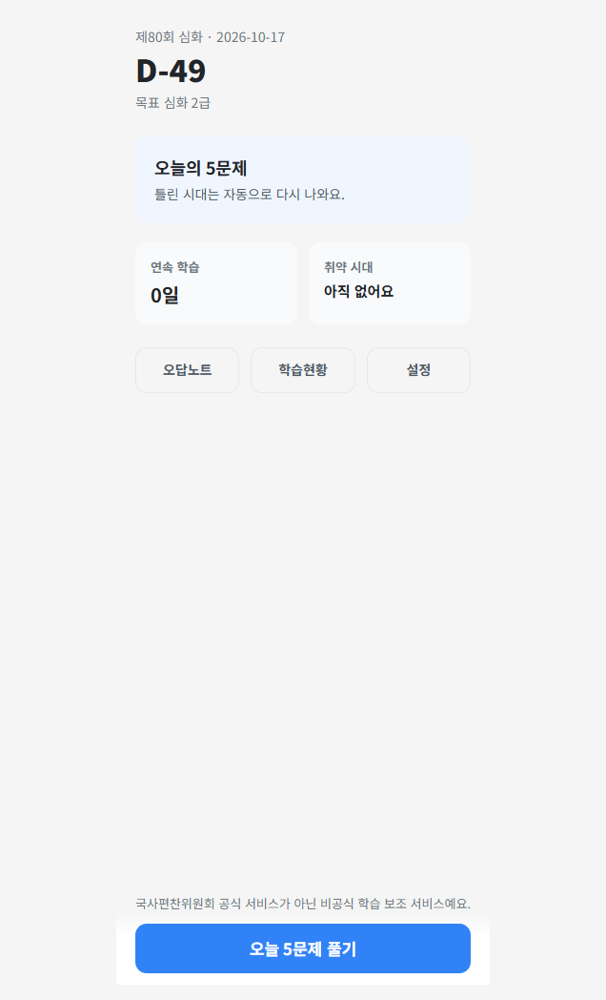
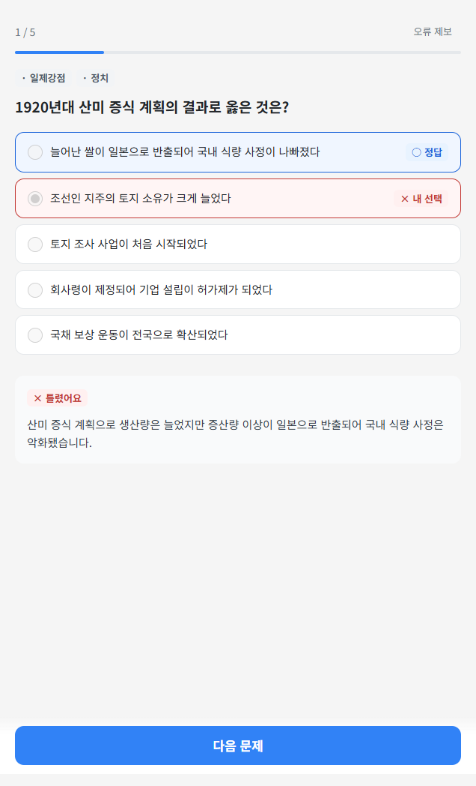
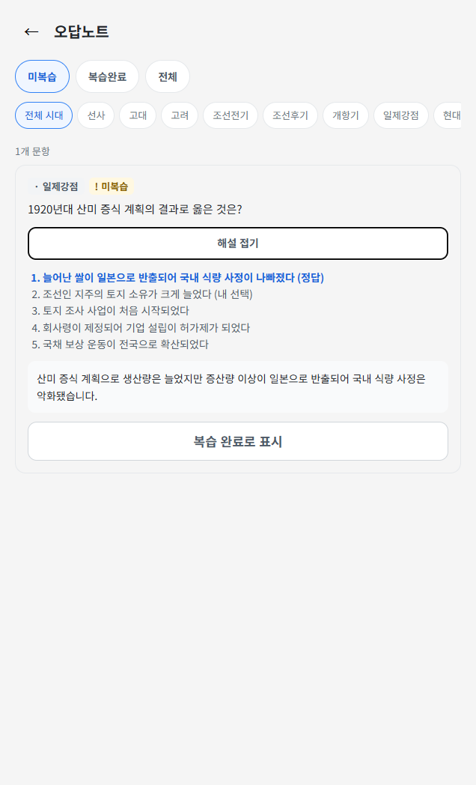

# 한능검 5분

**다음 시험까지, 매일 5문제**

한국사능력검정시험 심화를 준비하는 짧은 학습 습관. 
토스에서 오늘의 문제를 풀고, 틀린 시대를 다시 복습하세요.

[시작하기](#시작하기) · [화면 미리보기](#화면-미리보기) · [문의하기](mailto:leedonghwiid00@gmail.com)

> 국사편찬위원회 공식 서비스가 아닌 **비공식 학습 보조 서비스**입니다.

## 화면 미리보기

| 오늘의 학습 | 문제와 해설 | 오답노트 |
| :---: | :---: | :---: |
|  |  |  |

기존 앱 화면을 촬영한 미리보기입니다. 화면의 시험일·D-day·학습 기록은 예시이며, 현재 이용 버전에 따라 화면 구성이 다를 수 있습니다.

## 짧게 풀고, 틀린 부분은 다시

많은 문제를 한꺼번에 푸는 것보다, 매일 학습을 이어가는 데 집중합니다.

| 특징 | 이렇게 활용하세요 |
| --- | --- |
| **하루 5문제** | 오늘의 문제를 풀고 짧은 해설로 핵심을 확인하세요. |
| **오답 기반 복습** | 틀린 문항을 복습 일정에 따라 일부씩 다시 만나세요. |
| **시대별 학습 현황** | 학습 기록을 보며 부족한 시대를 확인하세요. |
| **목표 시험 D-day** | 목표 급수와 회차를 정하고 시험까지 준비를 이어가세요. |

오답노트에서 시대별로 문항을 모아 보고, 연속 학습 기록으로 학습을 이어온 날도 확인할 수 있습니다.

## 시작하기

1. **토스에서 찾기** — 토스 앱에서 **한능검 5분**을 검색하세요.
2. **목표 정하기** — 목표 급수(1·2·3급)와 시험 회차를 선택하세요.
3. **오늘의 5문제 풀기** — 답안을 제출하고 정답과 해설을 확인하세요.
4. **복습 이어가기** — 오답노트와 학습 현황으로 틀린 부분을 돌아보세요.

## 이용 안내

### 어떤 시험을 준비하는 앱인가요?

한국사능력검정시험 **심화** 준비를 위한 학습 보조 앱입니다. 기본 시험 모드와 시험 접수·합격 조회는 제공하지 않으며, 합격이나 합격 확률을 보장하지 않습니다.

### 공식 기출문제인가요?

공식 기출 원문·사진을 복제하지 않는 **자체 제작 텍스트 문항**을 사용합니다. 문항에서 오류를 발견하면 앱 안에서 제보할 수 있습니다.

### 틀린 문제는 모두 다음 날 나오나요?

아니요. 오답은 복습 일정과 출제 구성에 따라 일부씩 다시 나옵니다. 오답노트에서는 틀린 문항을 따로 확인할 수 있습니다.

### 인터넷 연결이 필요한가요?

인터넷 연결이 필요하며, 첫 접속 시 서버 응답이 지연될 수 있습니다. 학습 일자는 기기 시간이 아닌 서버의 한국 시간(Asia/Seoul)을 기준으로 합니다.

### 학습 데이터를 삭제할 수 있나요?

앱 **설정**에서 데이터 삭제를 요청할 수 있습니다. 요청이 접수되면 기존 계정의 접근이 차단되고, 관련 데이터는 서버에서 순차 처리됩니다. 접수 즉시 모든 저장소에서 삭제가 끝나는 것은 아닙니다.

## 문의

- **이용 문의:** [leedonghwiid00@gmail.com](mailto:leedonghwiid00@gmail.com)
- **문항 오류:** 앱 내 오류 제보 기능을 이용해주세요.
- 문의할 때 식별키·인증 토큰 등 민감한 정보는 보내지 마세요.
